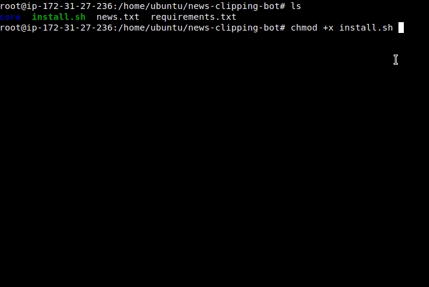

# News Clipping Bot

---

### About
A bot that collects information of interest and sends it through Telegram Messenger.  
For now the use is approved in GNU/Linux Ubuntu.  

### Install and run
- You can deploy to a vps or on premise VM.
- After downloading and unzipping:   
    - Put the API token in `./core/settings/token.txt`  
    - Customize your news sources with twitter usernames in `./core/settings/sources.txt`  
- Set run perm and run `install.sh` file.

  

### Features
- To uninstall, run `install.sh`  and select the option to uninstall.  
- After installed the Bot will run as `clippingbot.service`. You can check:
```bash
sudo systemctl enable clippingbot.service
```

### Usage
- On first use send `start` message to your bot.  
- Send `news` message to your bot.  
 

### License
GPL v3 

---

2022 April 16 - version 0.1


